# HRM Suite - Mobile + Admin + Backend

Repository nay gom 3 phan chinh cho ung dung HRM:
- `Frontend/`: Mobile app (Expo + React Native)
- `adminSide/`: Admin dashboard (React + Vite + TypeScript)
- `Backend/`: REST API (Node.js + Express + MongoDB)

## 1) Tong quan he thong

Muc tieu cua project:
- Quan ly nhan su, cham cong, nghi phep, payroll.
- Ho tro su dung cho nhan vien tren mobile va admin tren web.
- Dong bo du lieu qua API backend, co xac thuc JWT va tenant isolation.

## 2) Cau truc thu muc

```text
codeZoneMobile/
|- Backend/                 # API server + scripts
|- Frontend/                # Mobile app (Expo)
|- adminSide/               # Admin dashboard
|- run-dev.ps1              # Script mo nhanh 2 terminal (Backend + Frontend)
|- QUICK-TEST.md            # Huong dan test nhanh
|- CREATE-ADMIN-GUIDE.md    # Huong dan tao admin
```

## 3) Cong nghe su dung

- Mobile: Expo, React Native, TypeScript
- Admin Web: React, Vite, TypeScript, Tailwind
- Backend: Node.js, Express, MongoDB, JWT

## 4) Yeu cau moi truong

- Node.js `>=18`
- npm
- MongoDB (local hoac Atlas)

## 5) Huong dan chay local

### 5.1 Chay Backend

```bash
cd Backend
npm install
```

Tao file `Backend/.env` voi noi dung goi y:

```env
PORT=3000
NODE_ENV=development
MONGODB_URI=mongodb://localhost:27017/DACN
JWT_SECRET=your-super-secret-jwt-key-change-this
JWT_EXPIRES_IN=7d
CORS_ORIGIN=http://localhost:8081

# Optional (QR / geofence)
QR_SECRET=your-qr-secret
QR_WINDOW_SECONDS=10
QR_MAX_SKEW_WINDOWS=2
OFFICE_LAT=
OFFICE_LNG=
OFFICE_RADIUS_METERS=100
```

Chay server:

```bash
npm run dev
```

API mac dinh: `http://localhost:3000/api`

### 5.2 Chay Mobile App (Frontend)

```bash
cd Frontend
npm install
```

Tao file `Frontend/.env`:

```env
# Neu chay tren dien thoai that: dung IP LAN may chay backend
EXPO_PUBLIC_API_URL=http://192.168.1.10:3000/api
```

Chay app:

```bash
npm start
```

Lenh nhanh:

```bash
npm run android
npm run ios
npm run web
```

Luu y API URL:
- Web: `http://localhost:3000/api`
- Android Emulator: `http://10.0.2.2:3000/api`
- Dien thoai that: dung IP LAN (vd `http://192.168.1.10:3000/api`)

### 5.3 Chay Admin Dashboard

```bash
cd adminSide
npm install
```

Tao file `adminSide/.env`:

```env
VITE_API_URL=http://localhost:3000/api
```

Chay dashboard:

```bash
npm run dev
```

Build production:

```bash
npm run build
```

## 6) Chay nhanh bang script (Windows)

Tu root project:

```powershell
.\run-dev.ps1
```

Script se mo 2 terminal:
- Backend (`Backend/`)
- Frontend (`Frontend/`)

## 7) Tai khoan admin de test

Tao admin nhanh:

```bash
cd Backend
npm run create-admin
```

Thong tin mac dinh:
- Email: `admin@example.com`
- Password: `admin123`

Xem them: [CREATE-ADMIN-GUIDE.md](./CREATE-ADMIN-GUIDE.md)

## 8) Checklist test nhanh

File tham khao:
- [QUICK-TEST.md](./QUICK-TEST.md)

Co the chay script checklist admin:

```bash
cd Backend
node scripts/run-adminside-checklist.js
```

## 9) Hinh anh demo (Images_readme)

Tat ca anh ben duoi duoc load truc tiep tu thu muc `Images_readme/`.

### 9.1 Tong quan he thong
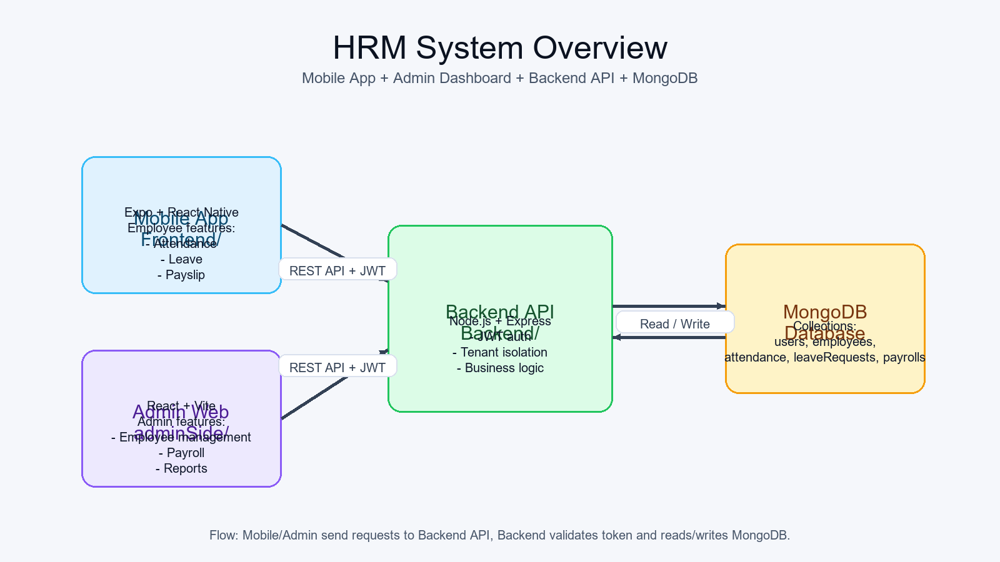

### 9.2 Mobile App
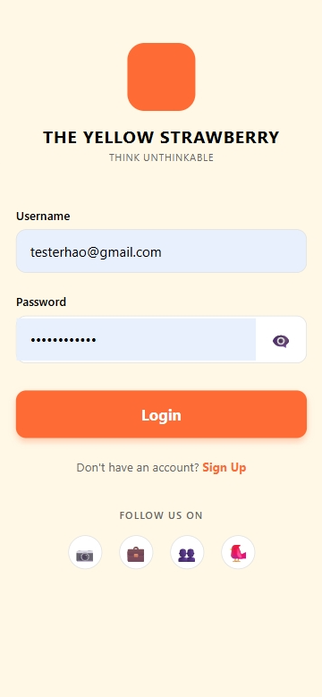
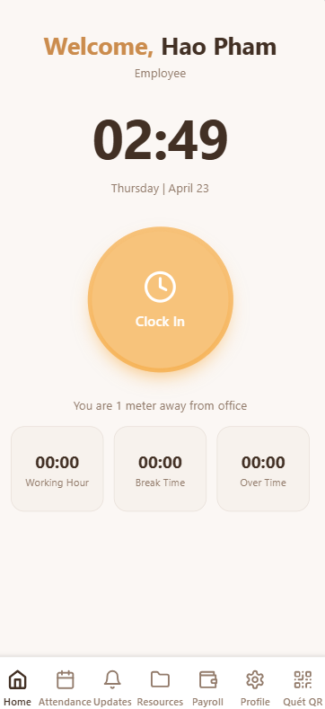
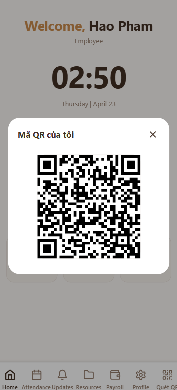
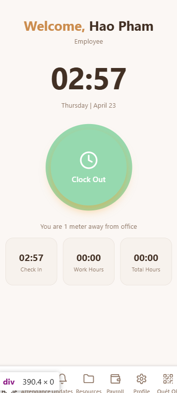

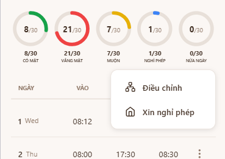
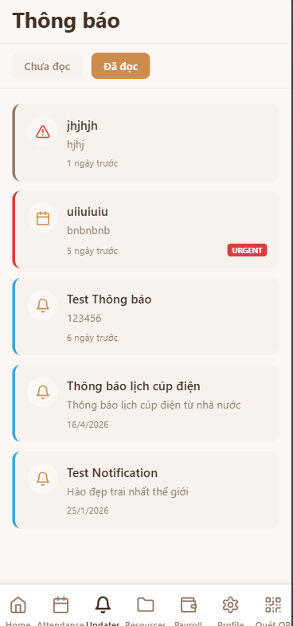
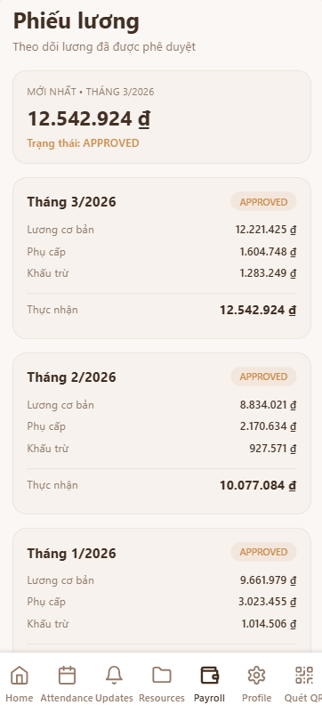

### 9.3 Admin Web
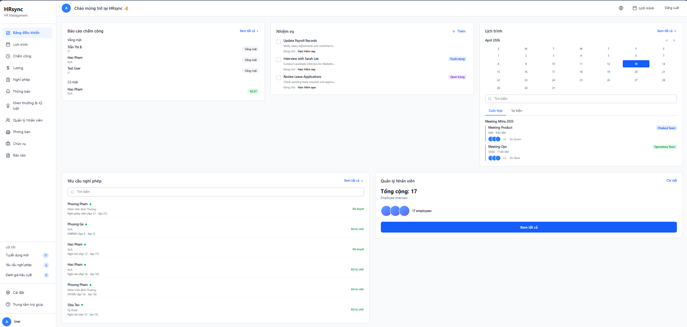
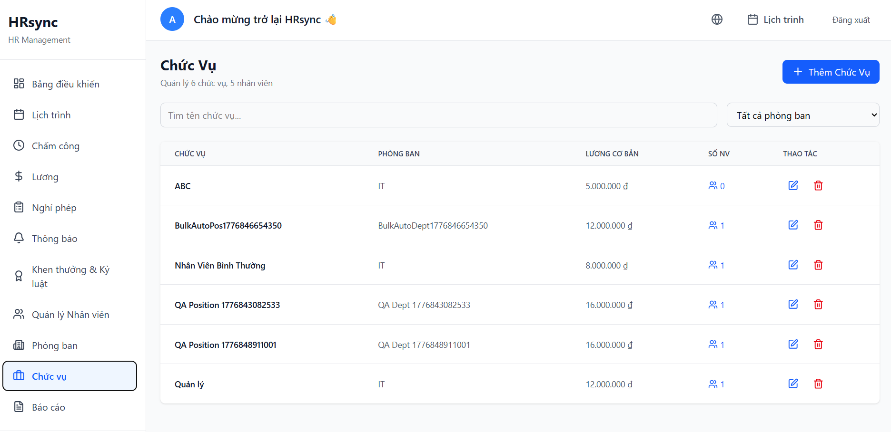
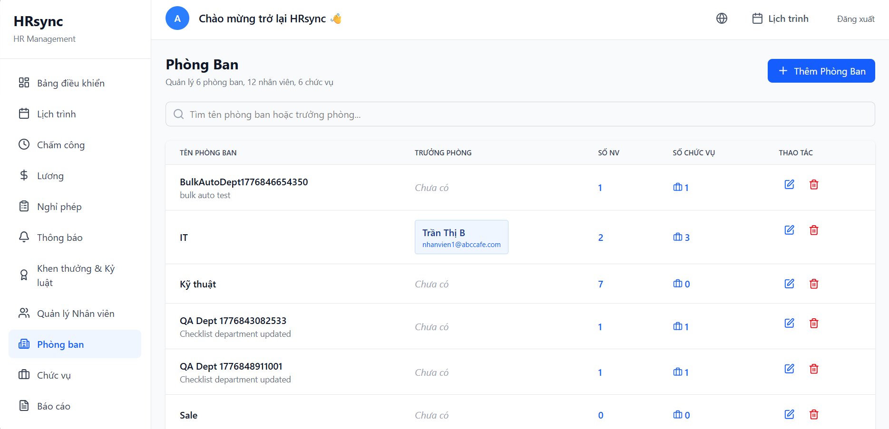
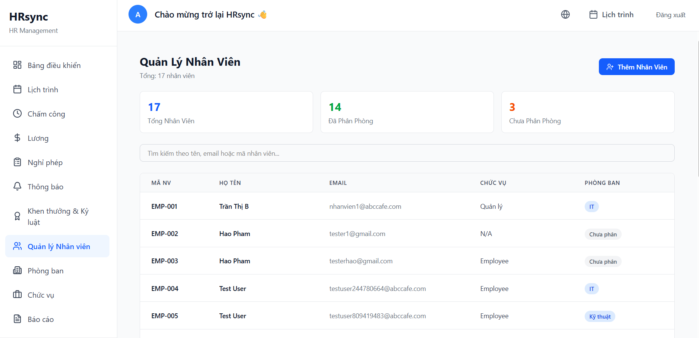
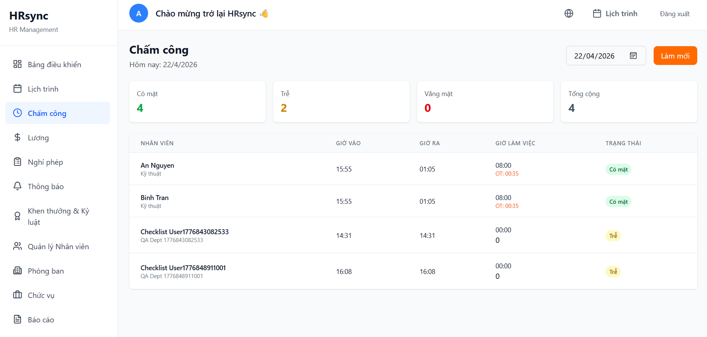
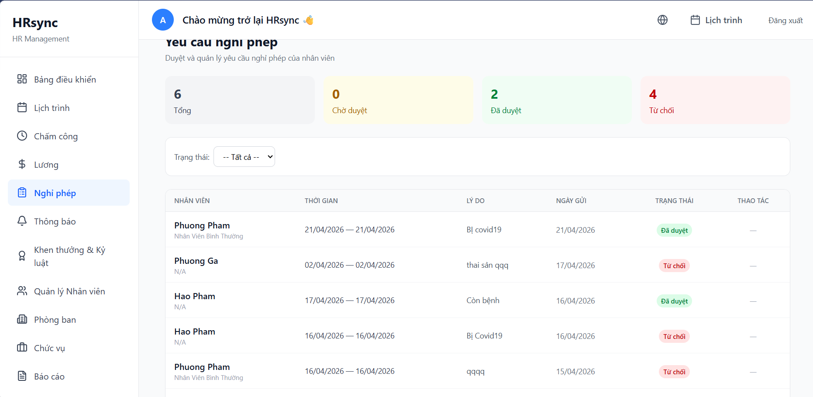

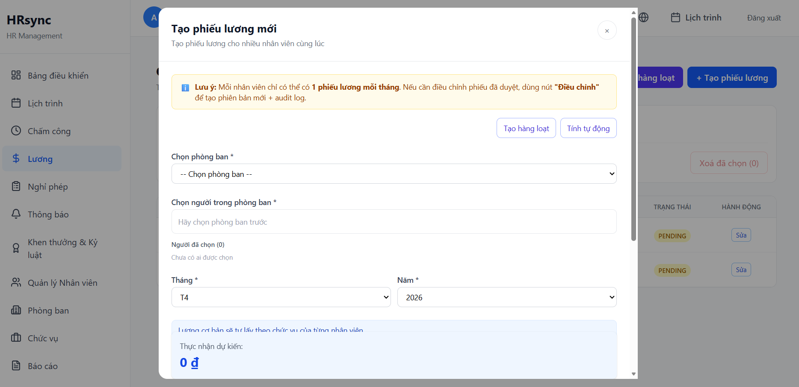
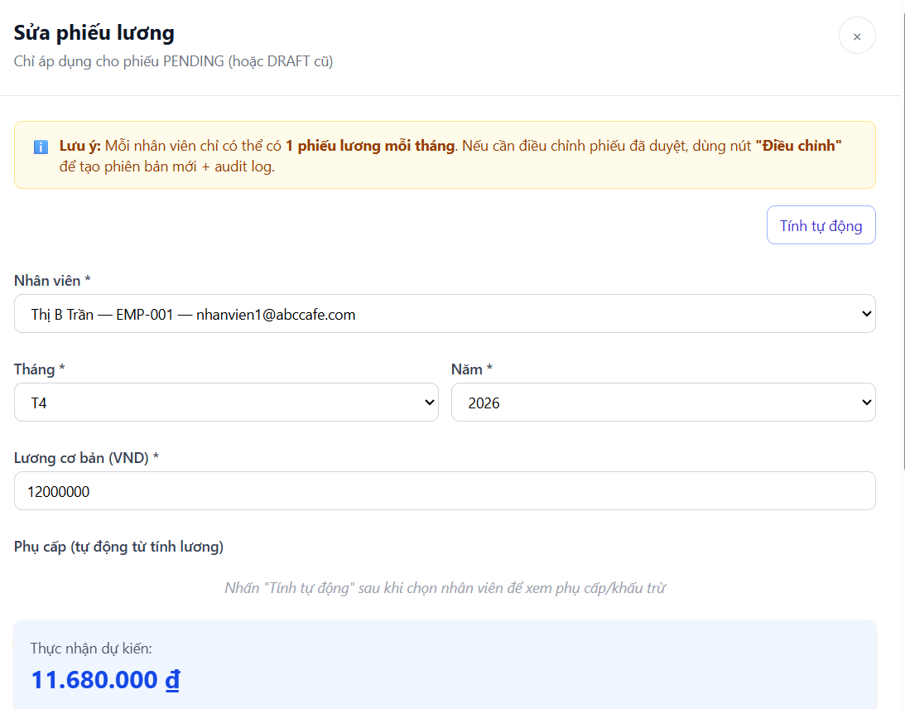
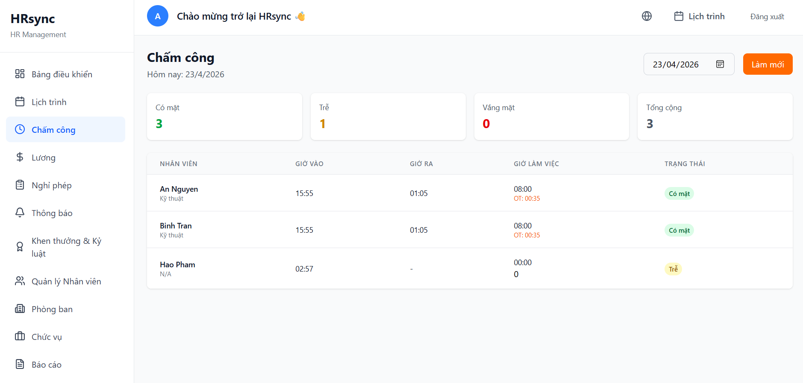
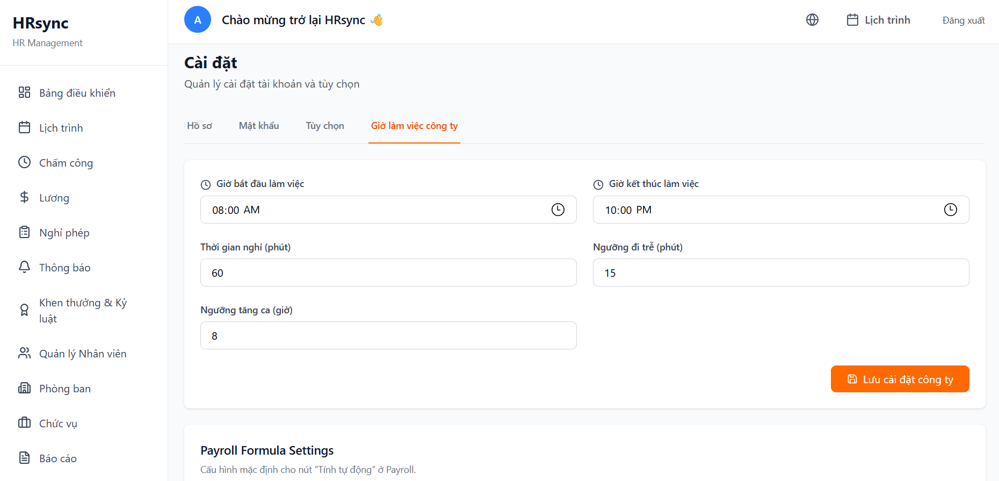
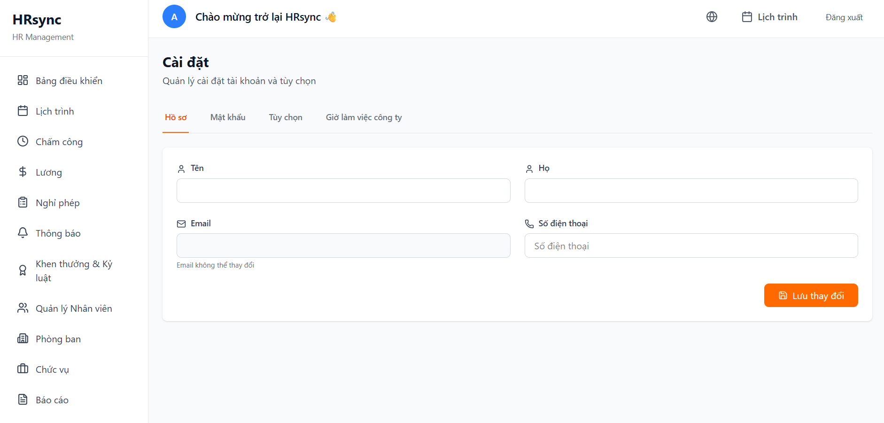

### 9.4 API Docs
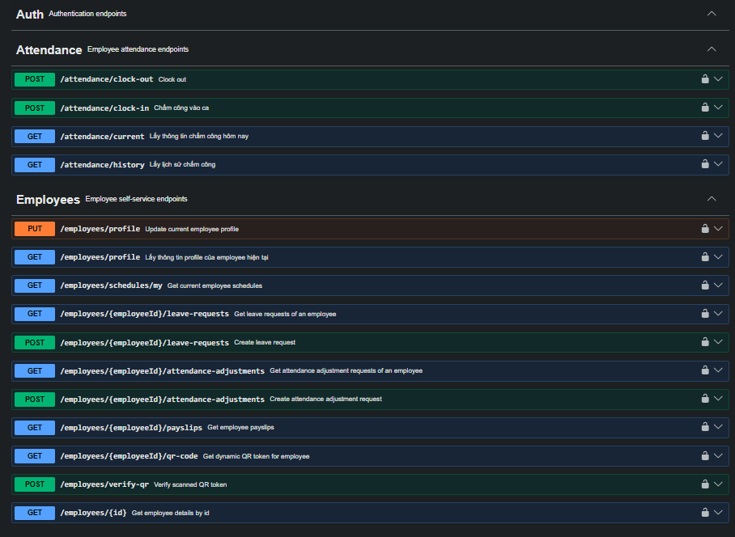
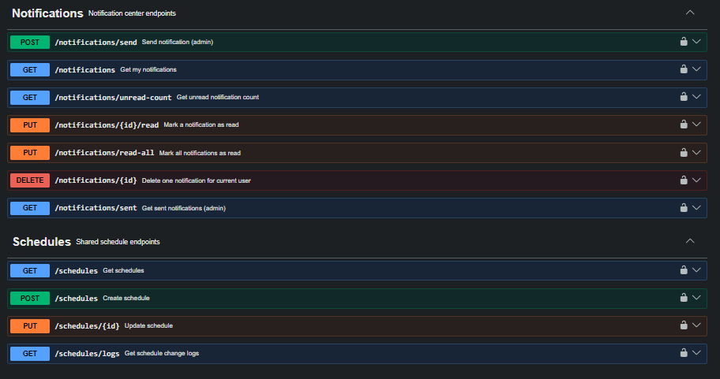
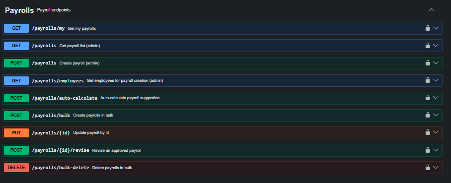

## 10) Cap nhat gan day

- Payroll bulk: da ho tro auto-tinh luong day du khi tao hang loat.
- Payroll status: da uu tien luong duyet theo `PENDING/APPROVED` (co mapping du lieu cu).
- Reports attendance: da sua logic thong ke de tranh dem chong va sai so.

## 11) Troubleshooting nhanh

### Mobile bao loi khong goi duoc API

- Kiem tra backend dang chay port `3000`.
- Kiem tra `EXPO_PUBLIC_API_URL` dung IP/port.
- Neu dung dien thoai that, khong dung `localhost`.

### Admin bi 401/Token issue

- Kiem tra `VITE_API_URL`.
- Dang xuat/dang nhap lai de cap nhat token.
- Kiem tra backend co endpoint refresh token va dong bo JWT secret.

### Backend khong ket noi MongoDB

- Kiem tra `MONGODB_URI`.
- Kiem tra service MongoDB dang chay.

## 12) Tai lieu lien quan

- [Backend README](./Backend/README.md)
- [AdminSide README](./adminSide/README.md)
- [Quick Test](./QUICK-TEST.md)
- [Create Admin Guide](./CREATE-ADMIN-GUIDE.md)
